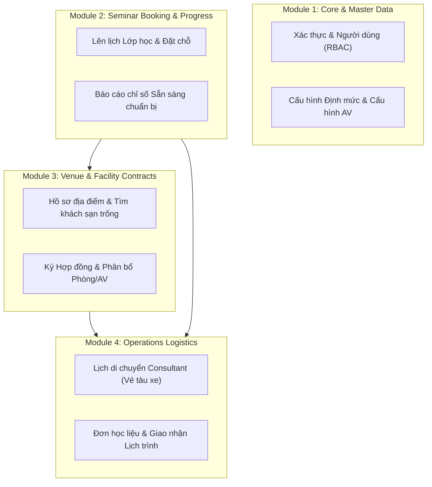

# Training Logistics Management System (Modular Monolith)

Hệ thống quản lý hậu cần đào tạo chuyên nghiệp (Training Logistics Management) dành cho Training, Inc. được xây dựng theo mô hình **Kiến trúc Monolith Hướng Phân Hệ (Modular Monolith)** nhằm đảm bảo khả năng mở rộng, tính kết dính cao và ranh giới nghiệp vụ độc lập.

---

## 1. KHÁI NIỆM TỔ CHỨC MODULAR MONOLITH

Hệ thống chia toàn bộ ứng dụng lớn thành **4 Phân hệ Nghiệp vụ Chính (Macro-Modules)**. Mỗi phân hệ tự chịu trách nhiệm về cơ sở dữ liệu riêng của nó, đồng thời cung cấp giao tiếp rạch ròi qua tầng Service. Điều này giúp loại bỏ hoàn toàn các liên kết cứng (như các truy vấn `JOIN SQL` chéo bảng hệ thống) và sẵn sàng tách thành Microservices độc lập trong tương lai.



---

## 2. 4 PHÂN HỆ NGHIỆP VỤ CHÍNH (MACRO-MODULES)

### Phân hệ 1: System Core & Master Data (Quản trị Hệ thống & Dữ liệu Danh mục)
*   **Mô tả**: Quản lý an ninh hệ thống, tài khoản người dùng, phân quyền chi tiết (Role-Based Access Control - RBAC) và định nghĩa các tham số cấu hình tĩnh.
*   **Phạm vi nghiệp vụ**:
    *   **Xác thực**: Đăng nhập, phân quyền người dùng thông qua mã Bearer Token tự ký.
    *   **Tham số định mức**: Cấu hình các định mức học liệu và thiết bị nghe nhìn AV mặc định cho từng loại chuyên đề (`seminar_type`), làm cơ sở để tự động tính toán nhu cầu vật tư thực tế dựa trên sĩ số học viên dự kiến.
    *   **Danh mục**: Quản lý thông tin Giảng viên (Consultants), Nhân viên (Employees), Thiết bị nghe nhìn (AV Equipment) và Kho Học liệu (Materials).

### Phân hệ 2: Seminar Booking & Readiness (Đặt lịch & Giám sát Tiến độ)
*   **Mô tả**: Khởi tạo kế hoạch tổ chức chuyên đề giảng dạy và giám sát toàn diện độ chuẩn bị hậu cần.
*   **Phạm vi nghiệp vụ**:
    *   **Tạo Lịch lớp học**: Nhập thông tin ngày tổ chức, thành phố tổ chức, chuyên đề và phân bổ Giảng viên phụ trách.
    *   **Ràng buộc thời gian**: Kiểm tra xung đột lịch trình của Giảng viên (Consultant) trong khoảng thời gian diễn ra lớp học mới, ngăn chặn phân bổ trùng lặp lịch dạy.
    *   **Độ sẵn sàng (Readiness Indicator)**: Đọc chỉ số tiến độ từ Phân hệ 3 và Phân hệ 4 để phân tích thời gian thực xem lớp học đã sẵn sàng giảng dạy chưa (Ready = Hợp đồng địa điểm đã ký + Vé Consultant đã xác nhận + Học liệu đã giao tới khách sạn).

### Phân hệ 3: Venue Reservation & Contracts (Địa điểm & Hợp đồng thuê)
*   **Mô tả**: Quản lý quy trình khảo sát địa điểm tổ chức (Khách sạn/Trung tâm hội nghị) và ký kết hợp đồng thương lượng giá cả.
*   **Phạm vi nghiệp vụ**:
    *   **Khảo sát trống**: Thuật toán tìm kiếm các cơ sở vật chất khả dụng tại thành phố mục tiêu trong khoảng thời gian tổ chức Seminar mà chưa bị chiếm dụng bởi các hợp đồng ký chính thức khác.
    *   **Đàm phán & Giữ chỗ**: Tạm khóa địa điểm (`NOTSIGNED`), cho phép tải lên các tài liệu bản nháp thỏa thuận (Draft Documents).
    *   **Ký kết chính thức (`Finalize`)**: Khi hợp đồng được chuyển trạng thái thành `SIGNED`, hệ thống kích hoạt giao dịch ACID để: lưu bản scan hợp đồng PDF, tự động bóc tách và phân bổ chi tiết phòng tổ chức cùng thiết bị nghe nhìn AV thuê kèm.

### Phân hệ 4: Operations Logistics (Điều phối di chuyển & Giao nhận Học liệu)
*   **Mô tả**: Tổ chức hậu cần đi lại cho Consultant và chuỗi cung ứng vận chuyển học liệu giảng dạy tới lớp học.
*   **Phạm vi nghiệp vụ**:
    *   **Travel Arrangement**: Điều phối viên nhập thông tin hành trình di chuyển thực tế (vé máy bay, tàu xe, mã hiệu chuyến đi, thời gian). Consultant có quyền truy cập để xem và nhấn nút xác nhận hành trình di chuyển của mình.
    *   **Material Procurement**: Tạo yêu cầu xuất kho học liệu thực tế dựa trên tính toán sĩ số học viên dự kiến.
    *   **Quy trình Giao nhận & Đối soát**: Chuyển trạng thái đơn hàng qua các bước (`ACKNOWLEDGED` -> `PACKED` -> `SHIPPED` -> `DELIVERED`). Mỗi sự thay đổi trạng thái đều được tự động lưu dấu vết vào lịch sử đối soát (`shipment_log`) để phục vụ kiểm toán nội bộ.

---

## 3. CƠ CHẾ GIAO TIẾP VÀ RÀN BUỘC GIAO DỊCH (TRANSACTION BOUNDARIES)

*   **Tính Độc lập của DB**: Không sử dụng lệnh `JOIN` chéo bảng giữa các thực thể thuộc phân hệ khác nhau.
*   **Độ Sẵn sàng động (Derived Dashboard)**: Trạng thái Sẵn sàng giảng dạy trên Dashboard là một chỉ số tính toán động (Derived Readiness) thông qua các lớp Service của Phân hệ 3 và Phân hệ 4, tránh tạo các quan hệ khóa ngoại cứng nhắc gây cản trở phân rã ứng dụng.
*   **Giao dịch ACID An toàn**: Sử dụng cơ chế `@Transactional` của Spring tại các Service phức tạp (ví dụ: Finalize Contract, Transition Material Shipment) để đảm bảo đồng bộ trạng thái dữ liệu chính xác hoặc tự động Rollback khi gặp sự cố bất ngờ.

---

## 4. HƯỚNG DẪN CÀI ĐẶT & CHẠY HỆ THỐNG

### Khởi chạy Backend

Yêu cầu: Java 21, Maven 3+.

```bash
# Biên dịch hệ thống
mvn clean compile

# Chạy ứng dụng Spring Boot
mvn spring-boot:run
```

*   **URL mặc định**: `http://localhost:8080`
*   **Trình quản lý H2 Console (In-memory DB)**: `http://localhost:8080/h2-console` (JDBC URL: `jdbc:h2:mem:training_logistics`)

### Khởi chạy Frontend (ReactJS + Tailwind CSS v4 + Vite)

Yêu cầu: NodeJS 18+.

```bash
cd frontend
npm install
npm run dev
```

*   **URL mặc định**: `http://localhost:5173` (Được cấu hình Proxy tự động chuyển tiếp `/api` sang `http://localhost:8080`).
