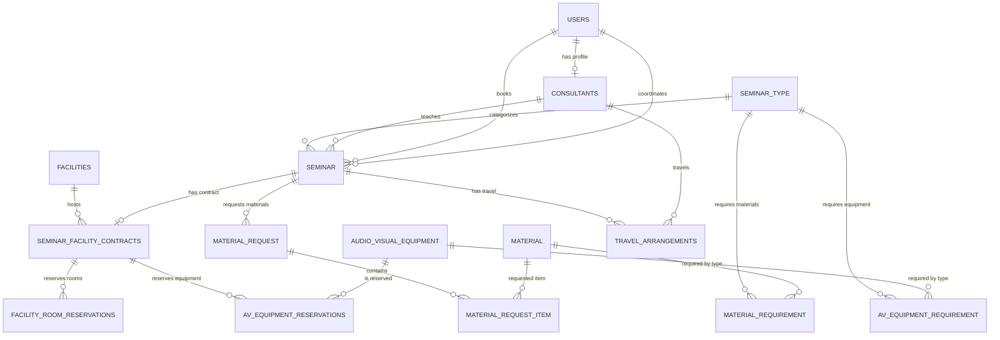

# ER Diagram

```mermaid
erDiagram
    USERS
    CONSULTANTS
    SEMINAR_TYPE
    SEMINAR
    FACILITIES
    SEMINAR_FACILITY_CONTRACTS
    FACILITY_ROOM_RESERVATIONS
    AUDIO_VISUAL_EQUIPMENT
    AV_EQUIPMENT_REQUIREMENT
    AV_EQUIPMENT_RESERVATIONS
    MATERIAL
    MATERIAL_REQUIREMENT
    MATERIAL_REQUEST
    MATERIAL_REQUEST_ITEM
    TRAVEL_ARRANGEMENTS

    USERS ||--o| CONSULTANTS : "has profile"
    SEMINAR_TYPE ||--o{ SEMINAR : "categorizes"
    CONSULTANTS ||--o{ SEMINAR : "teaches"
    USERS ||--o{ SEMINAR : "books"
    USERS ||--o{ SEMINAR : "coordinates"

    FACILITIES ||--o{ SEMINAR_FACILITY_CONTRACTS : "hosts"
    SEMINAR ||--o| SEMINAR_FACILITY_CONTRACTS : "has contract"
    SEMINAR_FACILITY_CONTRACTS ||--o{ FACILITY_ROOM_RESERVATIONS : "reserves rooms"
    SEMINAR_FACILITY_CONTRACTS ||--o{ AV_EQUIPMENT_RESERVATIONS : "reserves equipment"
    AUDIO_VISUAL_EQUIPMENT ||--o{ AV_EQUIPMENT_RESERVATIONS : "is reserved"

    SEMINAR_TYPE ||--o{ MATERIAL_REQUIREMENT : "requires materials"
    MATERIAL ||--o{ MATERIAL_REQUIREMENT : "required by type"
    SEMINAR_TYPE ||--o{ AV_EQUIPMENT_REQUIREMENT : "requires equipment"
    AUDIO_VISUAL_EQUIPMENT ||--o{ AV_EQUIPMENT_REQUIREMENT : "required by type"

    SEMINAR ||--o{ MATERIAL_REQUEST : "requests materials"
    MATERIAL_REQUEST ||--o{ MATERIAL_REQUEST_ITEM : "contains"
    MATERIAL ||--o{ MATERIAL_REQUEST_ITEM : "requested item"

    SEMINAR ||--o{ TRAVEL_ARRANGEMENTS : "has travel"
    CONSULTANTS ||--o{ TRAVEL_ARRANGEMENTS : "travels"
```
